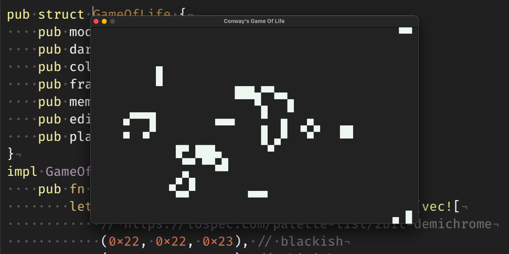

# Conway’s Game of Life

This is my first program written in [Rust](https://www.rust-lang.org): a simple implementation of [Conway’s Game of Life](https://en.wikipedia.org/wiki/Conway's_Game_of_Life). It uses [SDL2](https://www.libsdl.org).

## How it works

`cgol` directly starts in **Play** mode, that is the simulation is running.

Use `Return` key to switch between **Play** and **Edit** mode.

In **Edit** mode the simulation is stopped. A pixel grid is shown to aid »drawing«. Use `Left Mouse Button` to draw living cells and `Right Mouse Button` do clear cells.

The `F1` key allows you to switch between _dark mode_ and _light mode_.

Press the `Esc` key to quit the _Game of Life_.
